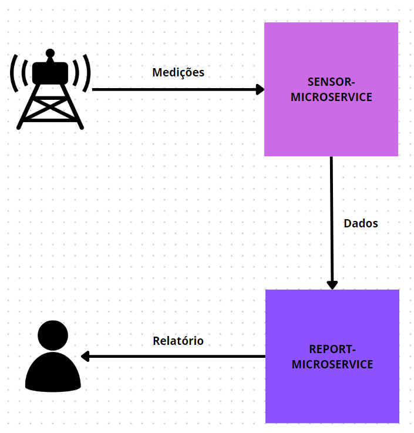

# Relatório 01 - sensor-microservice

Felipe Gabriel Comin Scheffel - RA117306  
Ciência da Computação - DIN - UEM  
6920 - Sistemas Distribuídos  
Prof. Raqueline Penteado

----

## Microserviços e suas aplicações

Os microserviços têm se destacado como uma abordagem arquitetônica eficiente na construção de sistemas de software. Em contraste com as arquiteturas monolíticas tradicionais, os microserviços propõem uma estrutura descentralizada e modularizada. Isso possibilita que os diversos componentes do sistema sejam desenvolvidos, implementados e mantidos de forma independente.

Cada microserviço é concebido para desempenhar uma função específica, sendo uma unidade autônoma, executada em um processo distinto dos outros microserviços da aplicação final. Os microserviços se comunicam de maneira baixamente acoplada e em pouca quantidade. São utilizados protocolos de comunicação de baixo custo. Por exemplo, cada microserviço de uma aplicação web pode ter uma URL própria, e eles podem se comunicar com o protocolo HTTP.

No ponto de vista de desenvolvimento, a arquitetura de microserviços se alinha à pergunta "Qual problema você quer resolver?". Normalmente, uma aplicação monolítica busca entregar muitas soluções ao mesmo tempo, enquanto cada microserviço pode ser desenvolvido com uma concentração muito mais focada em resolver um único problema.

Além disso, de maneira oposta a uniformidade técnologica que uma aplicação monolítica impõe, a descentralização dessa arquitetura permite que cada microserviço seja um projeto gerenciado, versionado e mantido separadamente. Ou seja, diferentes equipes podem desenvolver microserviços para uma mesma aplicação utilizando as linguagens de programação e ferramentas que julgarem mais adequadas para cada trabalho.

Tendo em vista esses pontos, os projetos dos microserviços acabam por ser naturalmente mais ágeis. Quanto menor um projeto, maior a facilidade de lhe dar manutenção, com bugs menos complicados e melhor identificação de possibilidades de reuso de código. O conhecimento de cada programador sobre a base de código também é relativamente maior, facilitando o desenvolvimento de novas features. Isso permite uma iteração veloz 

O próximo ponto vantajoso é a escalabilidade. Cada microserviço pode ser escalado de maneira independente, ajustando-se dinamicamente às demandas específicas de recursos. Aplicações monolíticas muitas vezes acabam inchando, com manutenção cada vez mais compliacada, frequentemente recorrendo a melhorias no hardware. Do contrário, a arquitetura em microserviços permite expansão horizontal, apresentando fácil adaptação para soluções como balanceamento de carga.

Em conclusão, os microserviços representam uma evolução notável na arquitetura de software, oferecendo soluções práticas para os desafios modernos do desenvolvimento de sistemas. Sua abordagem descentralizada e modularizada proporciona a flexibilidade necessária para enfrentar um ambiente dinâmico e exigente. Apesar das considerações cuidadosas necessárias para a implementação eficaz, os benefícios potenciais fazem dos microserviços uma escolha atraente para organizações que buscam inovação e eficiência no desenvolvimento de software complexo.

## Descrição do sistema

A aplicação a ser implementada se trata de um sistema de gerenciamento de sensores de informações meteorológicas. A partir da simulação de sensores que enviam medições coletadas, o sistema deverá ser capaz de receber e armazenar os dados, para então processar e apresentar novas informações calculadas a partir das medições.

Nessa primeira fase do projeto a aplicação será composta de dois microserviços: um deles será responsável pelos dados, com funcionalidades de cadastro, deleção e leitura, enquanto o outro será responsável pelo processamento e relatório.



## Implementação

O sistema foi implementado em JavaScript no ambiente de runtime Node.JS. Foram utilizadas algumas bibliotecas, com destaque para o framework de desenvolvimento web `express`, que permite a criação rápida de APIs RESTful, e a `axios`, que permite realizar requisições HTTP, sendo utilizada para comunicação direta entre os microserviços.

Cada microserviço foi criado como um projeto Node separado. Ou seja, cada microserviço é executado em um processo separado. Ambos os processos funcionam como servidores web, expondo endpoints para uma API RESTful. Os servidores são configurados em `server.js`, enquanto a estrutura de cada serviço é definida nos diretórios `api`.


```js
// Configuração dos servidores:
async function start(api) {
    const app = express();
    // ...
    api(app);

    server = app.listen(process.env.PORT);
    return server;
}
```

```js
// Inicializando servidor
(async () => {
    require("dotenv").config();
    const report = require('./api/report');
    const server = require("./server/server");
 
    try {
        await server.start(report);
        console.log('Server is up and running at ' + process.env.PORT);
    } catch (error) {
        console.error(error);
    }
})()
```

```js
// Estrutura da definição das APIs:
module.exports = (app) => {
  app.post('/reading', async (req, res, next) => {
    // ...
  });

  app.delete('/readings', async (req, res, next) => {
    // ...
  });

  app.get('/readings', async (req, res, next) => {
    // ...
  });

  app.get('/last-reading', async (req, res, next) => {
    // ...
  });
};
```

A imagem abaixo é a documentação gerada no Postman de ambas as APIs, incluíndo as requests e respostas possíveis.


O microserviço `sensor` mantém uma lista em memória para armazenar as medições recebidas:
```js
let readings = [{
    temperature: // ...
    relativeHumidity: // ...
    windSpeed: // ...
    timestamp: // ...
}];
```

O microserviço `report` possui funções para o processamento dos dados, além de manter os caminhos das requisições que realiza para o microserviço `sensor` a fim de receber os dados:

```js
const SENSOR_SERVICE = 'http://localhost:3000';
const lastReadingPath = `${SENSOR_SERVICE}/last-reading`;
const readingsPath = `${SENSOR_SERVICE}/readings`;

function calcHeatIndex(temperature, relativeHumidity) {
  const tempFahrenheit = 1.8 * temperature + 32;
  const tempFahrenheitSqr = tempFahrenheit * tempFahrenheit;
  const relativeHumiditySqr = relativeHumidity * relativeHumidity;

  return (5 / 9) * (
    -42.379 +
    2.04901523 * tempFahrenheit +
    10.14333127 * relativeHumidity +
    -0.22475541 * tempFahrenheit * relativeHumidity +
    -6.83783e-03 * tempFahrenheitSqr +
    -5.481717e-02 * relativeHumiditySqr +
    1.22874e-03 * tempFahrenheitSqr * relativeHumidity +
    8.5282e-04 * tempFahrenheit * relativeHumiditySqr +
    -1.99e-06 * tempFahrenheitSqr * relativeHumiditySqr
  ) - 32;
}

function calcApparentTemp(temperature, windSpeed) {
  return 33 + (10 * Math.sqrt(windSpeed) + 10.45 - windSpeed) * ((temperature - 33) / 22);
}

module.exports = (app) => {
  app.get('/full-report', async (req, res, next) => {
    try {
      const response = await axios.get(readingsPath); // Requisição para serviço 'sensor'

      if (response.status === 204) {
        res.status(500).json({ error: 'Sensor data unavailable' });
      }

      // ...
    } catch (error) {
      console.error(error.message);
      res.status(500).json({ error: 'Internal server error.' });
    }
  });

  //...
};
```
