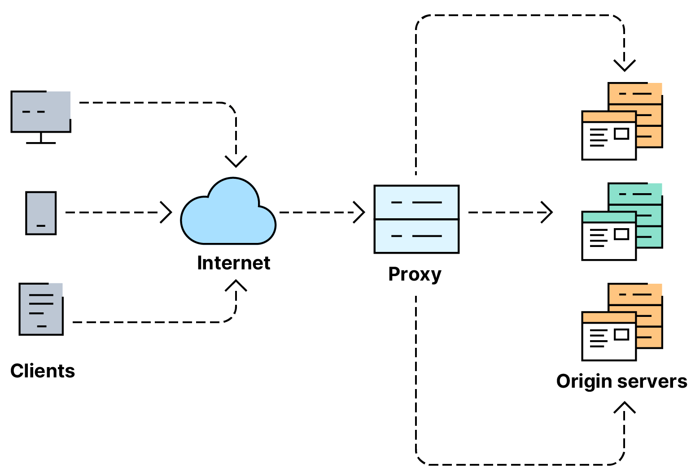
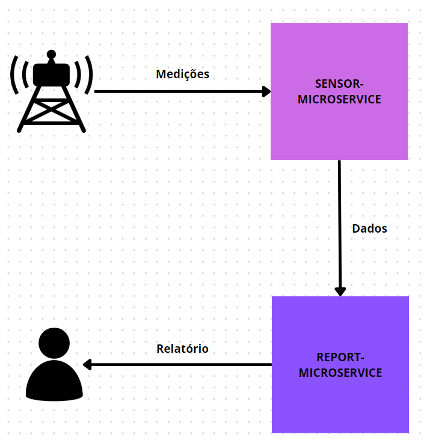
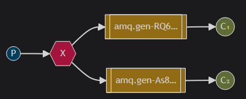
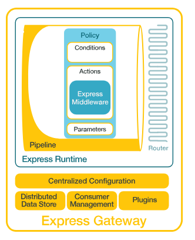

# Relatório 03 - sensor-microservice

Felipe Gabriel Comin Scheffel - RA117306  
Ciência da Computação - DIN - UEM  
6920 - Sistemas Distribuídos  
Prof. Raqueline Penteado

----

## API Gateway

Uma API Gateway é um componente essencial em arquiteturas de sistemas distribuídos que atua como um intermediário entre clientes e uma coleção de serviços de backend (ou APIs). Sua função principal é gerenciar, rotear, proteger e otimizar o tráfego entre esses serviços e os clientes que os consomem. Algumas das suas principais funções são:

- Roteamento de solicitações: A API Gateway encaminha solicitações de clientes para os serviços de backend apropriados. Isso simplifica a interação do cliente, pois eles só precisam se comunicar com um ponto de entrada único, independentemente do número de serviços subjacentes.

- Autenticação e autorização: A API Gateway pode lidar com autenticação e autorização de forma centralizada, garantindo que apenas usuários autorizados possam acessar os serviços de backend. Isso simplifica a implementação de políticas de segurança consistentes em toda a arquitetura.

- Balanceamento de carga: Uma das vantagens significativas é a capacidade de distribuir o tráfego de forma equilibrada entre os diferentes nós ou instâncias dos serviços de backend. Isso ajuda a otimizar o desempenho, evitar sobrecargas em servidores individuais e melhorar a escalabilidade.

- Tratamento de falhas: A API Gateway pode detectar falhas em serviços de backend e implementar estratégias de recuperação, como tentar novamente em outros nós, retornar uma resposta de erro adequada para o cliente ou redirecionar para um serviço de fallback. Isso melhora a resiliência do sistema e a experiência do usuário final.

- Transformação de dados: A API Gateway pode traduzir e transformar dados entre diferentes formatos de payload, tornando mais fácil para os clientes consumir os serviços de backend. Por exemplo, pode converter entre JSON e XML, realizar agregações de dados, ou mascarar campos sensíveis.

- Monitoramento e logging: A API Gateway pode fornecer insights valiosos sobre o tráfego de API, como métricas de uso, tempos de resposta e erros. Isso é crucial para monitorar o desempenho do sistema, diagnosticar problemas e tomar decisões informadas sobre ajustes na infraestrutura.

Em resumo, uma API Gateway oferece uma camada de abstração e gerenciamento entre clientes e serviços de backend, simplificando o desenvolvimento, melhorando a segurança, o desempenho e a confiabilidade do sistema como um todo. O balanceamento de carga e o tratamento de falhas são duas das suas características mais importantes para garantir um sistema resiliente e escalável.



## Descrição do sistema

A aplicação a ser implementada se trata de um sistema de gerenciamento de sensores de informações meteorológicas. A partir da simulação de sensores que enviam medições coletadas, o sistema deverá ser capaz de receber e armazenar os dados, para então processar e apresentar novas informações calculadas a partir das medições.

Nessa fase do projeto a aplicação será composta de dois microserviços: um deles será responsável pelos dados, com funcionalidades de cadastro, deleção e leitura, enquanto o outro será responsável pelo processamento e relatório.



## Implementação

### Arquitetura da aplicação

O sistema foi implementado em JavaScript no ambiente de runtime Node.JS. Foram utilizadas algumas bibliotecas, com destaque para o framework de desenvolvimento web `express`, que permite a criação rápida de APIs RESTful; o `mongoose`, para conexão com um banco de dados MongoDB; e a `amqplib`, para conexão e operações com o RabbitMQ, possibilitando a comunicação indireta.

Cada microserviço foi criado como um projeto Node separado. Ou seja, cada microserviço é executado em um processo separado. Ambos os processos funcionam como servidores web, expondo endpoints para uma API RESTful. Os servidores são configurados em `server.js`, enquanto a estrutura de cada serviço é definida nos diretórios `api`.

A imagem abaixo é a documentação gerada no Postman de ambas as APIs, incluíndo as requests e respostas possíveis.


Diferentemente da primeira fase do projeto, o microserviço `sensor-service` não irá mais manter uma lista em memória para armazenar as medições recebidas, mas sim realizar as operações de cadastro, deleção e leitura diratamente no banco de dados.

Nessa fase do projeto, o microserviço `report-service` passa a ser replicada, sendo instânciado mais de uma vez, simulando servidores da vida real. Cada réplica roda como um processo separado, em uma porta única definida por uma variável de ambiente.

Portanto, a comunicação passa a ser feita seguindo o modelo publicador-consumidor. O `sensor-service` é responsável por inserir toda nova medição em uma "exchange", e cada `report-service` terá uma fila 
anônima consumindo essa exchange.



Configuração da exchange:

```js
await channel.assertExchange(exchange, 'fanout', { durable: false });
const { queue } = await channel.assertQueue('', { exclusive: true });
await channel.bindQueue(queue, exchange, '');
```

Publicação (`sensor-service`):

```js
channel.publish(exchange, '', Buffer.from(JSON.stringify(reading)));
```

Consumo (dos assinantes, `report-service`):
```js
channel.consume(queue, msg => {
    const reading = JSON.parse(msg.content.toString())
    // ...
  }, { noAck: true });
```

Como o `report-service` não se comunica mais diretamente com o serviço de dados, ele mantém um máximo de 20 medições mais recentes em memória, para poder realizar calculos como a temperatura média.

Outros detalhes implementados foram:
- Ao ser iniciado, o `sensor-service`publicas as leituras salvas em seu banco nas últimas 24h. Assim, caso o `report-service` também tenha sido desligado (e por consequência perdido as leituras que tinha em memória), ele pode ser atualizar novamente.
- Ao consumir uma publicação, o `report-service` verifica se ela já não havia sido salva em sua memória. De qualquer caso, é feito o ack da mensagem, já que ele a recebeu, apenas não é necessário tratá-la.

### express-gateway

Foi implementado um gateway utilizando a ferramenta express-gateway. Essa é uma ferramenta de código aberto construído em torno do express.js, e fornece uma solução robusta para gerenciar e proteger APIs, oferecendo recursos como roteamento, autenticação, autorização, controle de acesso, limitação de taxa e logging.

O express-gateway é altamente configurável e extensível, permitindo que os desenvolvedores adaptem facilmente o comportamento do gateway de acordo com os requisitos específicos do projeto. Ele é frequentemente utilizado em arquiteturas de microsserviços e sistemas distribuídos, onde há várias APIs que precisam ser gerenciadas e protegidas de forma centralizada.



Por meio de sua interface declarativa e plugins flexíveis, o express-gateway simplifica o processo de criação, manutenção e segurança de APIs, ajudando as equipes de desenvolvimento a focar mais no desenvolvimento de aplicativos e menos na infraestrutura subjacente.

Abaixo segue o arquivo de configuração utilizado nesse projeto. Destacam-se as políticas de proxy, que redirecionam as requisições feitas para a porta do gateway (8080) para os caminhos adequados. Também pode ser visto que mais de uma URL foram definidas para o `report-service`, uma para cada réplica. O express-gateway realiza o balanceamento de carga por padrão, em um esquema round-robin.

```yaml
http:
  port: 8080
admin:
  port: 9876
  host: localhost
apiEndpoints:
  sensor-api:
    host: 'localhost'
    paths: '/sensor-service/*'
  report-api:
    host: 'localhost'
    paths: '/report-service/*'
serviceEndpoints:
  sensor:
    url: 'http://localhost:3000'
  report:
    urls:
      - 'http://localhost:3001'
      - 'http://localhost:3002'
      - 'http://localhost:3003'
policies:
  - basic-auth
  - cors
  - expression
  - key-auth
  - log
  - oauth2
  - proxy
  - rate-limit
pipelines:
  report-pipeline:
    apiEndpoints:
      - report-api
    policies:
      - proxy:
          - action:
              serviceEndpoint: report
              changeOrigin: true
              stripPath: true
  sensor-pipeline:
    apiEndpoints:
      - sensor-api
    policies:
      - proxy:
          - action:
              serviceEndpoint: sensor
              changeOrigin: true
              stripPath: true
```